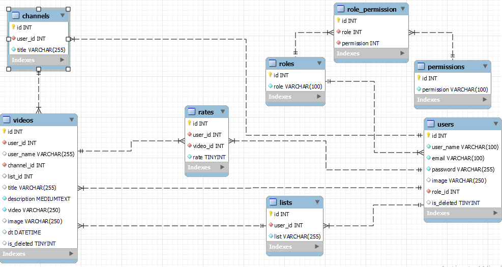

<p align="center">
  <a href="#" rel="noopener">
 </a>
</p>

<h3 align="center">Code Up</h3>

---

<p align="center">platform to share learning video about programing.
    <br> 
</p>

## 📝 Table of Contents

## 🧐 About <a name = "about"></a>

The main idea of the project is an integrated community that brings together programmers from all over the world to exchange information, I'll talk a little bit about the main idea of the project and why I see it as important, the platform sharing videos about programming helps programmers to easily reach the that they want,
anyone can make a channel and upload videos sharing his knowledge about anything in programming languages.
Here comes the role of our project to implement all these ideas by spreading communities within the site to exchange information-

## User Story <a name = "built_using"></a>

[Trello](https://trello.com/b/hNCALbDi/leaning-app)

## Data Model

<div>
 
</div>

## ⛏️ Built Using <a name = "built_using"></a>

- [MySQL](https://www.mongodb.com/) - Database
- [Express JS](https://expressjs.com/) - Server Framework
- [React JS](https://https://reactjs.org/) - Web Framework
- [Node JS](https://nodejs.org/en/) - Server Environment


## 🏁 Getting Started <a name = "getting_started"></a>

To start using this web App you have to first,clone this repo in your local machine.

```
git clone
https://github.com/C4-AnasAlkhamis/MERAKI_Academy_Project_6.git
```

### Database & Postman

you must install MySQL and Postman,\
MySQL: database is used to store the data, like users Sign UP posts, comments, chat groups, etc.\
Postman: helps for testing your APIs

### Run code

```
backend => command (npm run dev)
frontend => command (npm start)
```

### Prerequisites

What things you need to install the software and how to install them.

### backend

```
bcrypt
cors
dotenv
express
jsonwebtoken
mysql2
```

### frontend

```
create React app
axios
react-icons
react-router-dom
timeago.js
```

### Installing

After the files are downloaded, open the files in a text editor like VScode, Atom

use the terminal like(git Bash) to install packages for the front in and back End by using command,

```
npm init -y
```

```
npm i
```


## ⚠️ Guided By <a name = "guided_by"></a>

This project is guided by ©️ **[Anas Alkhamis](https://www.meraki-academy.org)**

# Acknowledgments

🌹[MERAKI Academy](https://www.meraki-academy.org)🌹
